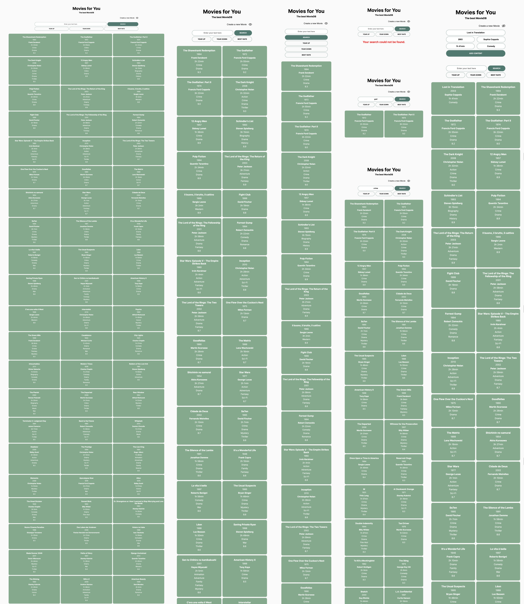

# SuperCode Movie DataBase Project

## Purpose of the website

- Sort movies by date and rating
- Filter movies that match the user's search criteria such as Movie title, year of release, director, duration, genre and rating
- User can add new movies to the database

## Built with

- Responsive Design
- Grid Layout
- Flexbox Layout
- JavaScript ES6+

## Links

- [See live site here](https://thomaserdmenger.github.io/superCode-Movies-Project)
- [GitHub Repository](https://github.com/thomaserdmenger/superCode-Movies-Project)
- [GitHub Author](https://github.com/thomaserdmenger)
- [LinkedIn Author](https://www.linkedin.com/in/thomaserdmenger/)

## Screenshot

